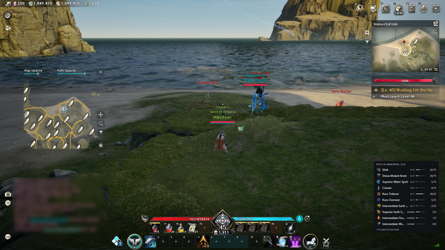
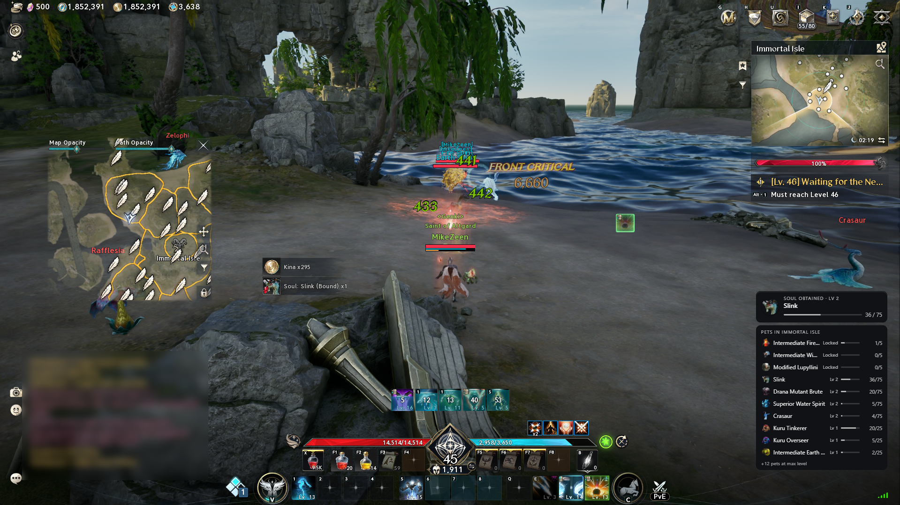
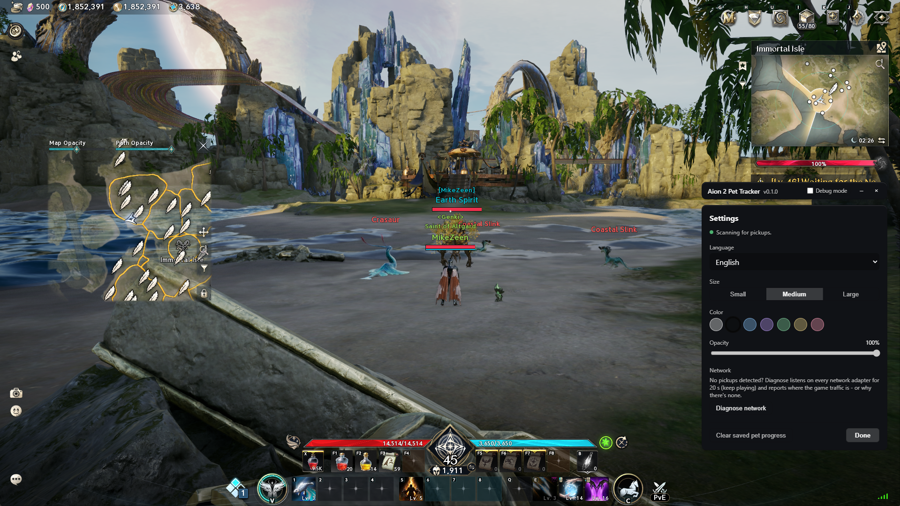

# Aion 2 Pet Tracker

A small always-on-top overlay for Aion 2 that tracks your pet soul collection while you play.



> **Work in progress:** bugs can happen. A soul might not be counted, or the pet list might be wrong for your area. I'm constantly updating the tracker, and the app tells you when a new version is available.

## Features

- **Automatic progress:** reads your pet levels and soul counts from the game at login, and counts every soul you pick up after that.
- **Soul toasts:** each soul you pick up shows a short notification with the pet's progress toward its next level.
- **Pets in your area:** lists the pets you can farm where you are right now, with your progress on each.
- **Click-through:** the overlay never blocks the game.
- **Languages:** English, Deutsch, Français, Español, Português, Русский, 한국어, 日本語 and 中文 (繁體), including translated pet names. The system language is used by default.

## Getting started

### Requirements

- Windows 10 or 11
- [Npcap](https://npcap.com), installed with the default options
- Administrator rights, which packet capture needs. The app asks for them on launch.

### Installation

1. Download the latest zip from the [Releases](https://github.com/MikeZeen/aion2-pet-tracker/releases) page.
2. Unzip it anywhere. Keep `aion2-pet-tracker.exe` and `watcher.exe` in the same folder.
3. Run `aion2-pet-tracker.exe`.

There's no installer. To remove the tracker, delete the folder.

## Using the tracker

1. Start the tracker, then start Aion 2 and log in. Your pet progress syncs as soon as you enter the world.
2. Play as usual. The overlay shows the pets of your current area, and every soul you pick up appears as a toast:

   

3. Press `Ctrl+Shift+M` to switch between the overlay and the settings, where you can change the language, size, color and opacity:

   

### Which maps are covered

The pet lists come from the game's drop tables: a pet is listed for an area only if a monster there drops its soul. Shop and event pets are never listed. How precise the list is depends on the map:

| Map | What the list shows |
|---|---|
| Verteron, Altgard | The pets of the exact area you're in, e.g. *Pets in Immortal Isle*. |
| Lower Reshanta (Abyss) | All pets of the whole map, e.g. *Pets in Chaotic Lower Reshanta*. |
| Eltnen, Morheim | *Pets in Eltnen*: none from the drop tables, as their monsters don't drop pet souls. |
| Everywhere else | *Pets nearby*: only the pets of monsters around you that the tracker knows. |

On every map, the list also shows the pets of monsters near you whose area isn't known. The tracker also learns monsters it doesn't know while you play: when you pick up a soul, it remembers which monster dropped it, and from then on that monster's pet appears in the list whenever the monster is near you. These learned links are saved on your computer and kept between sessions.

## Troubleshooting

**Nothing is detected.** Open the settings with `Ctrl+Shift+M` and click **Diagnose network**. Keep playing while it runs: it listens on every network adapter for 20 seconds and reports where the game traffic is, or why there's none. This helps with VPNs and ping-reduction tools.

**The progress is wrong.** Log out and back in to resync from the game. If it stays wrong, use **Clear saved pet progress** in the settings, then log in again.

## Privacy and safety

The tracker only reads network traffic passively. It doesn't modify the game, inject anything or send any data. Its only connection is the update check against GitHub.

## Disclaimer

This is an unofficial fan project, not affiliated with or endorsed by NCSOFT. Aion 2 and all related names and artwork belong to their respective owners.

---

## Development

You need Node.js 20+, Rust (stable) and Python 3.11+.

```sh
npm install
pip install -r scripts/requirements.txt
npm run tauri:dev     # dev build; runs scripts/watcher.py through Python
```

Live capture needs an elevated terminal. Without the game running, you can replay a capture:

```sh
python scripts/watcher.py --replay capture.pcap
```

### Building

```sh
npm run dist          # release build -> release/win-unpacked/
npm run dist:dev      # build with debug mode and DevTools -> release-dev/win-unpacked/
```

Both commands bundle the watcher into a standalone `watcher.exe` with PyInstaller, build the app and copy the two exes into one folder. The app is portable: zip that folder to distribute it.

### Project layout

| Path | Contents |
| --- | --- |
| `src/` | Vue frontend: overlay, toasts, settings |
| `src/data/` | Pet names (all languages), pet and monster IDs, areas; `pet_overrides.json` holds hand fixes to the area pet lists |
| `src/i18n/` | Interface translations |
| `public/portraits/` | Pet portraits |
| `src-tauri/` | Tauri shell: overlay window, shortcuts, watcher process |
| `scripts/protocol.py` | Decoder for the game's network protocol |
| `scripts/watcher.py` | Packet capture; sends events to the app as JSON lines |
| `scripts/diagnose.py` | Network diagnostics |

### AI usage

AI was used during development, mainly for the network analysis: working out the game's message framing and the packets for soul pickups, the pet collection, positions and areas from recorded captures. The decoded protocol is documented in `scripts/protocol.py`.
